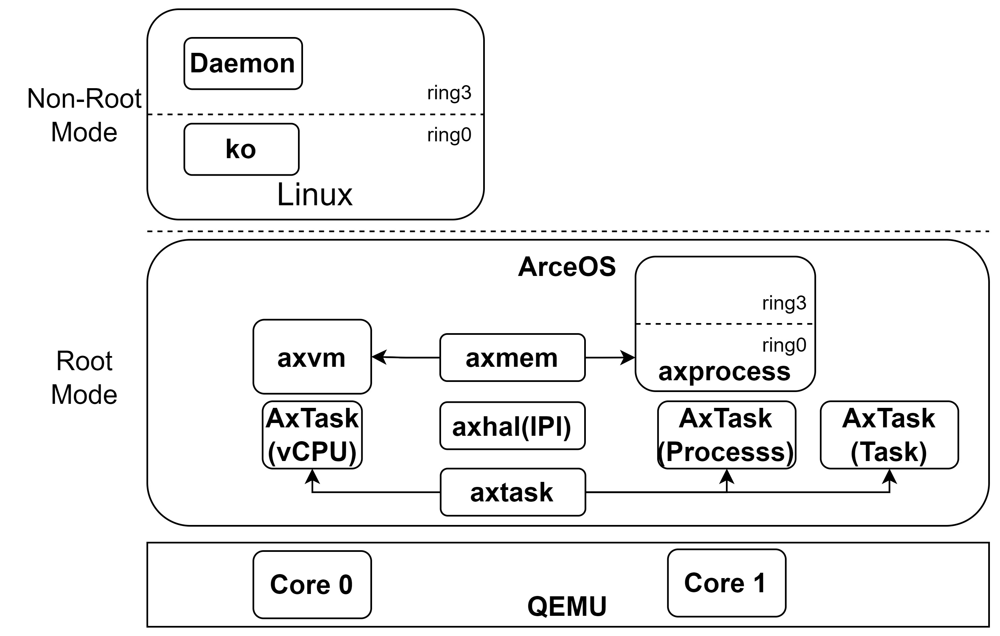

# Arceos-HV 2024 开发文档

<p align="right">胡柯洋</p>

## 背景与相关项目

### [ArceOS](https://github.com/rcore-os/arceos)

一个基于Rust语言编写的模块化操作系统（unikernel），在此不过多撰述。

ArceOS对系统各功能模块的良好抽象与接口设计使其非常适合进行系统功能上的弹性拓展（比如变成宏内核&hypervisor）。


### [cRTOS](https://github.com/fixstars/cRTOS)
复合实时操作系统 （Compounded Real-time operating system） 是一种实时操作系统（框架），提供快速 RTOS 的实时功能和丰富的标准接口（GPOS）。 

整个系统框架基于 Jailhouse（虚拟机管理程序）在单台机器上并行运行 Linux （GPOS） 和 Nuttx （sRTOS） 来实现的：

- 用户进程（Process）在 Nuttx 内部执行，时间关键型系统调用（time-critical system calls）在 Nuttx 本地处理；

- 而复杂的系统调用、凭据等则发送给在 Linux 端处理。

cRTOS 允许在实时操作系统 Nuttx 内执行标准 Linux 可执行 ELF ，而无需重新编译。 大多数标准的 Linux 程序都是开箱即用的（包括那些可以从 apt、yum、pacman 获得的程序）。 另外，开发者可以像普通的Linux程序员一样编写程序，调用更繁琐的RTOS API。

cRTOS的整体结构如下图所示：


cRTOS解决的关键技术问题：实现Jailhouse上两个虚拟机之间的syscall请求转发

cRTOS的核心设计要点：

* 利用 Jailhouse 提供的 IVSHMEM 机制，配合虚拟 PCI 设备实现虚拟机之间的通信，完成 syscall 请求转发

* 在 Linux 里面启动一个守护进程（daemon），配合内核模块（crtos-driver）实现 Nuttx 的用户进程与 Linux 里面的守护进程虚拟地址空间视图一致，并且二者映射到同一块物理内存空间，从而减少 syscall 请求转发过程中多余的用户地址空间数据的拷贝操作。


### rvm-rtos([Nimbos](https://github.com/rvm-rtos/nimbos)+[RVM1.5](https://github.com/rvm-rtos/RVM1.5))

项目地址：https://github.com/rvm-rtos/


一个基于 Jailhouse 前端（主要是内核模块驱动）、RVM1.5运行的，同时运行 Linux（配合 [nimbos-driver](https://github.com/rvm-rtos/nimbos-driver) ） 与 nimbos 的 dual-kernel 结构。

整个系统框架运行在两个物理核心上，其中0号核心运行通用 OS Linux ，1号核心运行实时 OS nimbos，并且由 Linux 内的 nimbos-driver（包括内核模块驱动与用户态守护进程）来接管来自实时域中的 nimbos 的部分系统调用（目前实现了 `sys_read` 与 `sys_write`）。

大致流程：
1. Linux裸机启动
2. 基于 Jailhouse 内核模块引导 RVM1.5 的启动，RVM1.5 启用 VMX 后配置 Linux 进入 non-Root 模式运行，回到 Linux 中
3. Linux 安装 nimbos-driver 内核模块驱动，在内核模块初始化过程中为nimbos分配内存并加载镜像，通过 hypercall 经由 RVM1.5 启动 nimbos
4. nimbos 启动过程中建立与 Linux 的共享内存通道
5. Linux 启动 nimbos-driver 用户态守护进程，注册singal机制并进入 loop 循环，准备“代理”后续来自 nimbos 的 syscall
6. nimbos 内核态的 syscall_handler 将系统调用参数封装，放入共享内存中的循环队列，通过 IPI 告知 Linux 的 nimbos-driver 内核模块驱动有一个新的syscall 请求
7. Linux 的 nimbos-driver 内核模块驱动通过 signal 机制告知 nimbos-driver 用户态守护进程从共享内存中的循环队列解析系统调用请求并执行，再将结果写入队列

### [Dune](https://www.usenix.org/conference/osdi12/technical-sessions/presentation/belay)等

Dune是一个能为应用程序提供直接但安全访问硬件能力（比如页表、快表等等）的系统。

主要思路其实是基于 VMCall 来 mock syscall，从而在保留标准操作系统抽象的同时安全有效地将特权硬件功能暴露给用户程序。

目标不一致，但是系统的整体结构对这次项目的实现有类似之处 ———— 与 Linux 配合，为某些特定需求的任务提供一个独立且安全的（虚拟化）执行环境。

主要由一个可加载的内核模块（Dume Module）以及为 “Dune 用户程序”提供的接口库 （libDune）组成，大致结构如下图所示：


## 关键技术设计

- 混合架构的模块化系统内核实现
  - 基于模块化内核 arceos 进行拓展
  - 通过不同的模块依赖配置与组装，在一个系统内核中同时支持轻量级任务线程、具有独立地址空间与完整资源抽象的进程以及客户虚拟机
    - 轻量任务线程 —— unikernel
    - 用户进程 —— monolithic kernel
    - 客户虚拟机 —— hypervisor
- 线程、进程以及vCPU的资源管理与调度
  - 基于 arceos 的 AxTask 实现不同类型任务的统一调度
  - 模块化、灵活配置，解耦调度器与调度任务
- 利用虚拟化分区中运行的 Linux 代理来自 arceos 中实时进程的系统调用
  - 同时具备了实时性与通用性
  - 参考 rvm-rtos 以及 cRTOS 的部分实现
- arceos-hv的type1.5实现
  - 参考 RVM1.5，修改 arceos-hv 的启动顺序
    - ori：先启动 arceos-hv，再引导 Linux 启动
    - 1.5：先启动 Linux，再引导 arceos-hv 启动
  - Type1.5 启动的优点：Linux接管设备与初始化过程，简化 arceos-hv 实现
  - work in process

## 系统整体结构

基于 arceos 原有的模块化结构，arceos-hv 拓展了用户进程（宏内核）以及虚拟机（Hypervisor）支持：

* 新增 axprocess 模块用于用户进程的管理
* 新增 axmem 模块用于独立地址空间的管理（`MemorySet`）
* 新增 axvm 模块用于客户虚拟机的管理
* 修改 axhal 模块支持 syscall 陷入以及包括缺页错误在内的用户态异常的处理
* 修改 axtask 模块，拓展 `TaskInner`，支持来自 axprocess 的异常上下文管理以及内核态线程调度以及来自 axvm 的 vcpu 资源调度。



为了实现让 Non-Root 模式中运行的 Linux 接管来自 axprocess 的 syscall，arceos-hv：
* 修改 axhal，新增核间中断（Inter-Processor Interrupt，IPI）的支持
* axmem 中新增共享物理地址空间的配置，建立 axvm 与 axprocess 的一段共享内存通道
* axprocess 模块中新增 syscall forward 功能支持（`scf` module），负责部分 syscall 请求的封装与发送

## 具体实现

### axtask 拓展

为了在 arceos 原有的 unikernel 内核模块化结构的基础上实现对用户进程与虚拟机的支持，arceos-hv 项目拓展了原有的 axtask 模块中的 `TaskInner` 结构体

新增 `task_type: TaskType,` 域，替换原本的 `entry: Option<*mut dyn FnOnce()>,`

其中，`TaskType` 为一个枚举类，标识 axtask 管理的任务类型

```(Rust)
#[derive(Debug)]
pub enum TaskType {
    /// ArceOS task.
    Task { entry: Option<*mut dyn FnOnce()> },
    /// User process.
    #[cfg(feature = "monolithic")]
    Process { trap_frame: Box<TrapFrame> },
    /// Virtual CPU
    /// To be improved...
    #[cfg(feature = "hv")]
    Vcpu { vcpu: Box<VCpu<HyperCraftHalImpl>> },
}
```
* `TaskType::Task` 表示该 task 为一个 arceos 普通任务，存储 task 的入口函数，通过**函数调用**进入 task 代码运行；

* `TaskType::Process` 表示该 task 上承载的是一个用户 process，此时 task 相当于这个用户 process 的内核线程，存储用户 process 的异常上下文 `TrapFrame`，通过特权指令（如 `iretq`）切换异常等级进入用户代码运行；

* `TaskType::Vcpu` 表示该 task 上承载的是一个客户虚拟机，此时 task 相当于这个客户虚拟机的 vcpu 线程，存储客户虚拟机 vcpu 的相关资源（目前由 hypercraft 支持），通过虚拟化拓展指令 `vmlaunch` 进入 non-root 模式下硬件支持的虚拟化环境中运行。

基本设计思路如图所示：


`task_entry` 函数修改如下：

```(Rust)
extern "C" fn task_entry() -> ! {
    // release the lock that was implicitly held across the reschedule
    unsafe { crate::RUN_QUEUE.force_unlock() };

    #[cfg(feature = "irq")]
    axhal::arch::enable_irqs();
    let task = crate::current();

    match &task.task_type {
        TaskType::Task { entry } => {
            if let Some(entry) = entry {
                unsafe { Box::from_raw(*entry)() };
            }
            crate::exit(0)
        }
        TaskType::Process { trap_frame } => {
            let kernel_sp = task.get_kernel_stack_top().unwrap();
            unsafe { trap_frame.exec(kernel_sp) }
        }
        TaskType::Vcpu { vcpu } => {
            unimplemented!("Enter Vcpu")
        }
    }
}
```

axproccess、axvm 与 axtask 模块的依赖关系为：


### syscall forward 机制实现

syscall forward 机制主要包括 axprocess 下的 `scf` 模块、共享内存配置以及在 Linux 下的可加载内核模块与用户态守护进程组成。

#### scf（syscall forward ）


`scf` 模块负责系统调用参数的封装与发送，主要包括：

* 用于共享内存空间管理的 `allocator`
* 用于系统调用请求与结果管理的队列 `SyscallQueueBuffer`
* 用于系统调用内容传递的数据队列 `SyscallDataBuffer`
* 用于系统调用结果同步的信号量 `SyscallCondVar`
* 用于系统调用参数包装的结构体 `SyscallArgs`
* 时钟中断事件，用于从 `SyscallQueueBuffer` 拉取已经完成的 syscall 请求


#### 共享内存

共享内存主要负责 Linux 与 axprocess 之间的系统调用传递，由于 arceos-hv 负责整个硬件平台的物理内存资源管理，可以划分出一块物理内存，通过 EPT 映射给 用户虚拟机（Linux），axprocess 可以直接通过一一映射的虚拟地址空间访问这段地址空间，实现内存共享。arceos的scf机制需要基于这段共享内存空间设计合适的消息传递与同步机制，完成系统调用请求的传递。

目前，arceos-hv 借鉴了 [rvm-rtos](https://github.com/rvm-rtos/) 中的共享内存队列，主要实现了 `SyscallQueueBuffer` 与 `SyscallDataBuffer`， 二者被放置于 arceos 物理内存的最后一段，具体的物理地址配置信息在 `axconfig` 模块中给出。

`SyscallDataBuffer`是 arceos-hv 项目中的一个临时实现，在传递一个 syscall 请求时，以 write 系统调用为例，对于用户态指针（如 write 调用的第二个参数存储期望写入的数据指针，第三个参数存放数据长度），需要从 `SyscallDataBuffer` 中申请一个对应大小的共享内存区域，再将具体数据从用户态地址拷贝到 `SyscallDataBuffer` 的这段共享内存区域暂存，再将具体数据在 `SyscallDataBuffer` 中的偏移作为第二个参数封装成 syscall req 通过 `SyscallQueueBuffer` 发送给 Linux，Linux 用户态守护进程从 `SyscallQueueBuffer` 中解析出待处理的 syscall req 后，会根据偏移从 `SyscallDataBuffer` 中将待写入的数据取出，通过 Linux 的 write 系统调用写到目标文件描述符（fd）中。

这种实现多了一次不必要的数据搬运，从而在一定程度上增加了 scf 的开销。

后续工作中，arceos-hv 的 scf 模块将采用类似 cRTOS 的方法，为 axprocess 与 Linux 的用户守护进程建立“镜像地址空间”，确保axprocess的物理内存与 Linux 的用户守护进程的虚拟地址空间视角一致，并被映射到同一段物理内存，从而移除 `SyscallDataBuffer` 的数据暂存步骤，Linux 的用户守护进程可以直接通过 axprocess 传递过来的用户态指针来读取数据，减少拷贝开销。


#### Linux 下的内核态驱动与用户态守护进程

arceos-hv 中 axprocess 的系统调用转发需要 Linux 内部的内核态驱动与用户态守护进程的共同支持，二者主要参考 [nimbos-driver](https://github.com/rvm-rtos/nimbos-driver) 实现。

内核态驱动主要负责为用户提供一个虚拟设备（`/dev/arceos vdev`），并实现设备相关方法（`mmap`等），为用户态守护进程建立用户虚拟地址空间到对应的共享内存空间（以一个设备内存的形式提供给Linux）的映射。同时，内核态驱动需要注册相关的中断处理函数，用于接收来自其他核心的IPI（告知有一个新的 syscall req），并通过 signal 机制告知用户态守护进程。

用户态守护进程需要 open 内核态驱动提供的虚拟设备，通过 `mmap` 方法主动建立相关的内存映射，并注册一个 `singal_handler`, 接收来自内核态驱动的 singal 主动从 `SyscallQueueBuffer` 中 poll 一个 sycall req 并通过 Linux 下的系统调用完成 syscall 处理，再将结果通过 `SyscallQueueBuffer` 写回。


## 下一步工作计划

* 优化 & 重构当前代码
* 完善 axtask 对属于 axvm 的 vcpu 资源的统一管理，重新设计对 vcpu 资源的抽象（复用 hypercraft & port hypercraft）
* 为 axprocess 与 Linux 的用户守护进程建立“镜像地址空间”，减少 syscall forward 过程中的数据拷贝
* 为 axprocess 支持更多的 syscall 转发，支持复杂应用